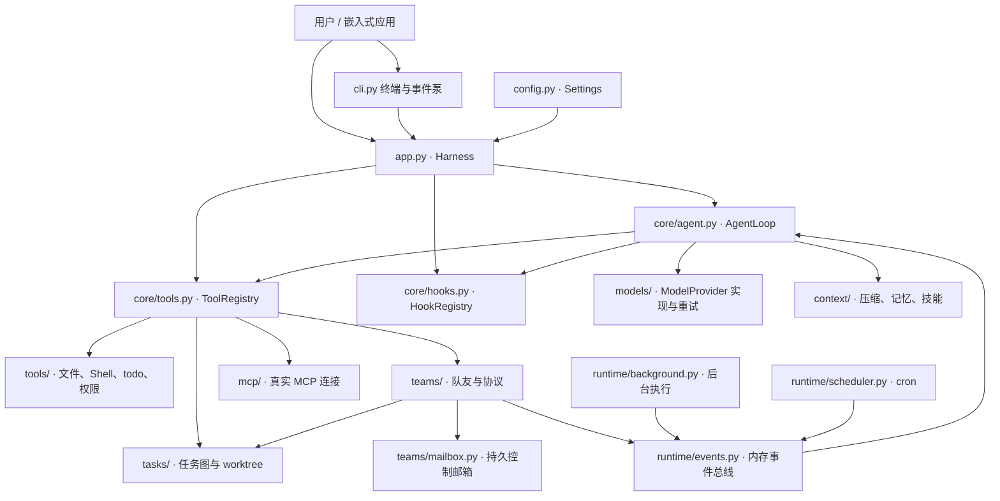
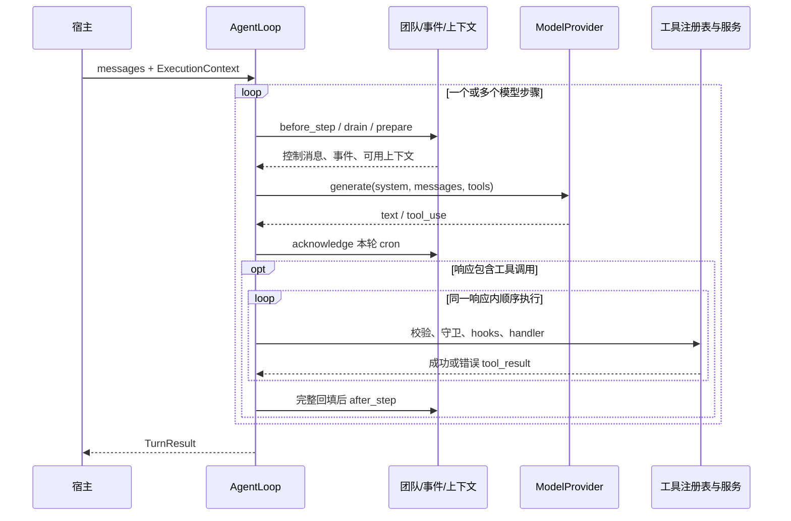

# 架构：从一个集成脚本到可组合的 Harness

这个项目把 s15 的主要机制组织成独立服务，并由 `Harness` 显式装配。模型仍然通过“接收消息 → 返回工具调用 → 宿主执行 → 回填结果”推进任务；文件存储、审批、团队、调度和网络连接都有各自的所有者。

建议依次阅读 [`core/types.py`](../src/mini_agent_harness/core/types.py)、[`core/agent.py`](../src/mini_agent_harness/core/agent.py) 和 [`app.py`](../src/mini_agent_harness/app.py)，再沿实际感兴趣的工具进入对应服务。与上游的逐项关系见 [s15 功能映射](s15-mapping.md)。

## 1. 模块职责与依赖方向



图里的箭头主要表示运行时调用或数据流。代码依赖遵守以下边界：

| 模块 | 核心职责 | 依赖与边界 |
|---|---|---|
| `config.py` | 解析指定 `.env`、进程环境与显式参数 | 不在导入时改写环境或初始化模型客户端 |
| `core/types.py` | `ExecutionContext`、`ModelResponse`、`ModelProvider`、`ToolSpec` | 共享的小型协议，不持有线程、连接和服务实例 |
| `core/agent.py` | 执行模型轮、工具轮、恢复和结果配对 | 通过构造器接收服务；不知道终端如何输入，也不导入 `Harness` |
| `core/tools.py` | 注册工具、按角色显示、JSON Schema 校验 | 定义和处理函数在同一个 `ToolSpec` 中，避免两张表不同步 |
| `core/hooks.py` | 用户输入、工具前后、停止扩展点 | 前置 hook 可拒绝调用；后置 hook 的失败不会伪装成工具未执行 |
| `models/` | Anthropic、OpenAI 两种 API 模式和重试 | SDK 对象只在此转换；主循环使用可序列化的内部消息 |
| `context/` | 工具输出预算、归档、压缩、记忆、技能 | 接收目录和可选 provider，不依赖终端或团队管理器 |
| `tools/` | 文件操作、Shell 进程组、会话 todo、审批策略 | 从 `ExecutionContext` 取身份和 `cwd`，不猜测当前 Agent |
| `tasks/` | 任务持久化、依赖、认领、租约、worktree | 不运行模型；任务存储和 Git 操作共同维护绑定的一致性 |
| `teams/` | 队友线程、消息、计划审批、关闭和 IDLE 认领 | 依赖任务服务，运行模型通过注入的 `runner` 回调完成 |
| `runtime/` | 内存通知、后台任务、持久 cron | 生产者发布事件，由消息所属 Agent 在安全点处理 |
| `mcp/` | 宿主配置、真实传输、远程工具注册和注销 | 只注册已配置服务器；远程工具描述不能提升宿主权限 |
| `prompt.py` | 组装身份、目录、技能目录和记忆资料 | 只拼装明确传入的数据，不执行参考文档中的命令 |
| `app.py` | 创建服务、注册工具、连接依赖、关闭资源 | 唯一的应用装配入口；业务模块不反向导入它 |
| `cli.py` | 参数、终端输入、审批 UI、自动事件唤醒 | 用异步终端承载同步 Harness API |

这里没有把原版全局变量换成一个“万能状态字典”。例如，任务归 `TaskStore`，审批记录归 `TeamsManager`，网络生命周期归 provider/MCP，消息历史则归具体会话。新增能力时，应先明确状态属于谁，再决定在哪个阶段调用它。

## 2. 四个核心协议

### 执行身份：`ExecutionContext`

`workspace` 是宿主工作区根目录，`cwd` 是本次工具操作的默认目录，两者不一定相同。`agent_id` 与 `role` 决定工具身份和可见范围，`task_id` 记录当前任务，`session_id` 隔离会话内状态，`interactive` 表示宿主此时是否允许请求人工批准。

身份由宿主创建，不能通过工具参数指定一个别人的 owner。队友每次模型调用和工具调用之前，都从任务租约刷新 `cwd`。一次性 subagent 保留派发时继承的目录，不参与共享任务认领。

### 模型边界：`ModelProvider`

`generate(messages, system=..., tools=..., max_tokens=...)` 返回 `ModelResponse`。主循环主要理解 `text`、`tool_use`、`tool_result`；厂商原生输出以带来源标记的附加块保存，在同一来源的后续请求中回传。这样可以保留 Responses reasoning 或 Anthropic thinking 的协议连续性，而不让核心循环操作 SDK 类型。

`RetryProvider` 包裹模型适配器，负责瞬态网络错误、退避和 fallback。工具 handler 不在重试器内部，避免一次文件写入或远程操作被网络恢复逻辑重复执行。上下文溢出单独返回给主循环，触发保存历史后的压缩。

### 工具边界：`ToolSpec`

一个工具在同一处声明名称、说明、输入 schema、处理函数、角色范围和是否需要批准。处理函数的形状为 `handler(ctx, args) -> str`。

工具调用经历三道独立检查：注册表验证名称、角色和参数；团队守卫验证 assignment 与计划状态；`PreToolUse` 验证宿主权限。把工具从 schema 中隐藏并不能替代执行时检查，因此注册表在分发时仍然检查角色。

### 事件边界：`Event`

事件包含 `kind`、`content` 和 `metadata`。生产者发布事件后不直接追加模型历史；相应 Agent 的循环调用 `drain(agent_id)` 取出事件。`wait()` 只等待，不消费，因此等待 UI 和真正的消息处理者不会互相抢走事件。

事件 metadata 是协议的一部分。例如计划事件携带 `request_id`，cron 携带 `cron_job_id`；这些标识不能只存在日志中，否则模型无法正确调用后续工具。

## 3. 一轮请求的真实顺序

`Harness.run()` 串行化 Lead 请求，触发 `UserPromptSubmit`，保存用户消息，再进入 `AgentLoop.run()`。一次用户请求可以包含多个模型步骤：

1. **检查停止与团队控制。** `teams.before_step(ctx)` 刷新任务身份、读取队友邮箱；pending 计划在此等待，关闭请求在此中断队友。
2. **取出运行时通知。** cron、后台结果和团队事件被追加为本轮资料。cron ID 暂存为“已交给本轮、尚未确认”。
3. **准备上下文。** 先确保调用与结果成组，再处理大输出和总预算、裁剪中段历史、缩短旧结果，必要时生成摘要。
4. **组装系统提示和工具集。** 根据当前身份、任务目录、技能目录和相关记忆构造 system prompt；从注册表读取当前角色可见的工具。刚连接的 MCP 工具由此进入下一次模型调用。
5. **调用模型。** provider 完成协议转换，重试层只重试模型请求。上下文溢出时主循环最多追加一次响应式压缩尝试。
6. **确认 cron 交付。** 收到成功的模型响应后才 acknowledge 本轮 cron；这表示提示已被模型接收，不表示其业务目标已经完成。
7. **处理截断。** 首次输出预算耗尽时提高预算并重试同一输入；后续续写受次数限制。未完整生成的工具参数不执行。
8. **执行工具。** 对同一响应中的每个 `tool_use` 顺序执行：schema/角色检查 → 团队守卫 → `PreToolUse` → handler → `PostToolUse`。失败也写入对应 `tool_result`，不会遗留悬空调用。
9. **结束完整工具组。** 一次性回填全部结果，再执行 `teams.after_step(ctx)`，释放本组已完成任务的目录租约。`compact` 也在结果配齐之后执行。
10. **继续或返回。** 有工具调用则进入下一步；无工具调用且未截断则返回。步骤上限通过 `TurnResult.status` 显式报告，不能被当成正常完成。

退出时触发 `Stop` hooks；尚未确认的 cron 允许重投。Lead 成功结束后，`Harness` 视配置提取/合并长期记忆，并在回合退出路径保存会话 JSON。



## 4. 三类 Agent 共用循环，各自拥有上下文

| 类别 | 创建与历史 | 任务与目录 | 生命周期与限制 |
|---|---|---|---|
| Lead | `Harness` 创建；会话历史由宿主持有 | 可创建任务图、主动认领、建立 worktree | 宿主输入与事件轮次串行；可派发和审批队友 |
| 一次性 subagent | `task` 工具；新的 history 和 session ID | 继承派发时的 `cwd`，不操作共享任务图 | 同步返回摘要；角色权限禁止递归派发和建队 |
| 持久 teammate | `spawn_teammate`；独立线程、history 和身份 | 认领后绑定任务；没有 assignment 不能操作文件/Shell | WORK → result → IDLE；邮箱或就绪任务可再次唤醒 |

“持久队友”指线程在多轮任务之间存活，并保留自己的对话历史。它不表示操作系统重启后会恢复同一条 Python 线程。未消费邮箱和任务记录在磁盘上，但线程、未决审批记录和 history 的自动恢复不在当前实现范围内。

所有 Agent 使用同一个 provider 接口和工具注册表；角色过滤给出各自工具子集。队友有额外的 `submit_plan`，Lead 有 `review_plan`。subagent 与 teammate 都是非交互身份，需要用户前台确认的 Shell 或 MCP 操作会被拒绝；Lead 批准一份计划不会自动替代单次工具的宿主权限审批。

## 5. task、assignment 和 plan version 如何配合

`Task` 是持久任务记录，主要包含 `id`、`status`、`owner`、`blocked_by`、`worktree`、`version`、`lease_active`。任务图提供依赖关系；assignment 表示某个 owner 此刻仍持有该任务工作目录的使用权。

典型流转是：

```text
create_task → pending，无 owner，无租约
update_task → 添加已存在的依赖，拒绝有向环
create_worktree（可选）→ 绑定独立 checkout，version 改变
claim_task → 依赖必须完成；owner 独占；lease_active=True；version 增加
complete_task → status=completed，owner 与租约暂时保留
完整工具组结束 → lease_active=False；version 增加；cwd 回到主工作区
```

为什么不能在 `complete_task` 内立即清空目录？假设模型在同一响应中要求“完成任务，再读取刚写好的文件”。如果完成工具立刻改掉 cwd，下一条读取就会落到主仓库。现在整个工具组始终使用原任务目录，宿主在明确边界释放它；同时，owner 在释放之前也不能再领取第二个任务。

认领过程在同一个文件事务中检查任务状态、全部依赖、owner 现有租约和 worktree registry，再写入新状态。`RLock` 处理本实例的线程，`flock` 处理其他进程，临时文件加原子替换防止读取半截 JSON。任务完成只接受实际 owner；worker 异常或关闭时，未完成任务回到 pending，已完成记录保留。

计划审批绑定 `(task_id, version)`，而不是只绑定队友名字：

1. 队友提交计划，生成 `request_id`，宿主记录当时的任务身份，状态变成 pending。
2. Lead 通过 `review_plan` 审批对应请求，控制邮箱投递结果。
3. 队友同时核对请求 ID、发送者、接收者、请求状态和任务版本，才能更新 plan gate。
4. 任务释放或重新认领后，旧审批变成 stale。即使旧响应随后到达，也不能放行新任务。

普通 `send_message` 只添加消息，不改变任务、版本或计划权限。`require_plan=True` 的队友在新的 assignment 上需要重新提交计划。等待审批期间不反复请求模型，也仍然响应关闭消息。

## 6. worktree 的职责和删除边界

worktree 位于 `workspace/.worktrees/<name>`，对应分支 `harness/<name>`。创建必须在 pending 且无 owner 的任务上进行；绑定前同时检查名称、目录、分支和 Git registry。队友认领时再次验证，而不把“目录存在”当成 worktree 有效的充分条件。

`WorktreeManager.remove()` 只提供宿主 API，没有模型删除工具。它拒绝仍有 owner/租约或运行中 Shell 的目录；含修改的目录需要同时设置 `discard_changes=True` 与 `confirmed=True`，后者由宿主在获得用户明确确认后传入。删除 checkout 后保留分支。创建失败时保留可能已产生的 checkout/branch 供检查，不进行猜测式破坏性回滚。

worktree 隔离 working copy。它不会限制已批准 Shell 命令访问操作系统其他位置；Shell 进程组清理也不能控制主动创建新 session 的后代进程。这里的权限检查与目录绑定不能等同于容器或系统沙箱。

## 7. 线程、文件与恢复边界

| 状态 | 存放位置 | 并发方式 | 重启后的行为 |
|---|---|---|---|
| Lead 当前 history | `Harness.history`；回合后写 `sessions/*.json` | Lead 锁串行化输入和事件轮次 | 文件可检查；CLI 不自动恢复旧对话 |
| teammate history / plan requests | 每个 `Teammate` 与 `TeamsManager` 内存 | 队友线程、团队锁 | 不自动复活线程或审批 |
| todo | `(session_id, agent_id)` 对应内存清单 | `TodoStore` 锁 | 新实例不保留 |
| task 与 assignment lease | `.harness/tasks/task_*.json` | 文件锁 + 实例线程锁 + 原子替换 | 保留记录；崩溃遗留租约需宿主检查后处理 |
| 队友控制邮箱 | `.harness/mailboxes/<recipient>.json` | 文件事务、Condition 唤醒 | 未消费消息保留 |
| 通用运行时事件 | `EventBus` 内存 FIFO | Condition | 不持久；普通消息/后台通知不保证崩溃后重投 |
| cron | `.harness/cron.json` | 单宿主调度线程和锁 | durable 项恢复；pending 项至少一次重投 |
| 长期记忆 | `.harness/memory/MEMORY.md` 和记录文件 | 文件锁；合并前检查快照 | 可在后续会话检索 |
| 上下文资料 | `.harness/context/tool-results/`、`transcripts/` | 唯一文件名和原子写入 | 保留完整输出/历史归档供恢复和审查 |
| Shell 输出 | `.harness/shell/shell-*.txt` | 每个进程独立文件 | 保留输出；运行中的进程不会自动恢复 |
| MCP 连接 | 每服务器一个线程中的长期协程 | 同步请求排队，协程拥有 SDK 生命周期 | 根据配置重新连接 |

当前服务组合面向**一个 workspace 对应一个活跃 Harness 宿主**。任务/邮箱的跨进程锁保护具体存储操作，但不意味着整个 Harness 已成为多宿主系统：cron 文件明确只支持一个宿主写入，其他服务也没有分布式协调协议。

cron 的交付顺序是“写 pending_delivery → 发布事件 → 模型成功响应 → 写 acknowledge”。中途崩溃可能重复交付，因此业务操作仍需要自己处理重复；宕机错过多个周期时合并为一次待交付，不会无限补跑。程序退出后没有常驻系统服务代替它计时。

关闭顺序由 `Harness.close()` 统一负责：停止新调度、终止 Shell 进程组、收拢后台执行和队友、关闭 MCP、最后释放 provider。队友关闭是协作式的；仍在阻塞调用中的线程不会被提前释放租约，模型和外部工具应各自有超时。

## 8. 上下文、记忆与参考资料

上下文治理的目标是让当前模型请求容纳必要信息，同时保留完整资料的位置。工具调用和结果必须成组处理，不能裁掉调用却留下孤立结果。压缩顺序为：大输出落盘/预算 → 中段归档 → 旧结果缩减 → 摘要；超出模型实际窗口时再进行一次响应式压缩。字符预算是估算，不是 token 计费器。

长期记忆独立实现 s09 的“目录检索 → 选择正文 → 回合后提取 → 必要时合并”流程，保留 user、feedback、project、reference 四类记录。模型选择失败时可退回关键词匹配。模型合并在文件锁外进行，回来后比较快照；如果期间有新记录，则放弃这次合并，避免覆盖并发更新。

技能首先只展示目录，通过 `load_skill` 按需读取全文。文件、技能、记忆、MCP 描述和摘要都作为参考资料进入提示，不能覆盖用户请求或宿主权限。宿主状态和 Git 元数据也不能通过普通文件写工具修改。

## 9. 扩展时改哪一层

新增本地工具时，在对应领域服务注册 `ToolSpec`，明确角色和审批需求；无需修改主循环的分发表。新增模型厂商时，实现 `ModelProvider` 并在应用配置处选用；要特别验证多工具结果配对、截断响应与厂商原生块回传。新增参考信息源时，把检索结果交给 prompt/context 层，不把来源文本当成新的宿主配置。

需要数据库、远程队友、Web UI 或操作系统沙箱时，可以沿这些已有协议替换服务，但这些能力不在当前框架中。当前实现保留 s15 的机制主线，并显式改变部分协议、默认值和生命周期；不能据此声称与上游逐行等价。
