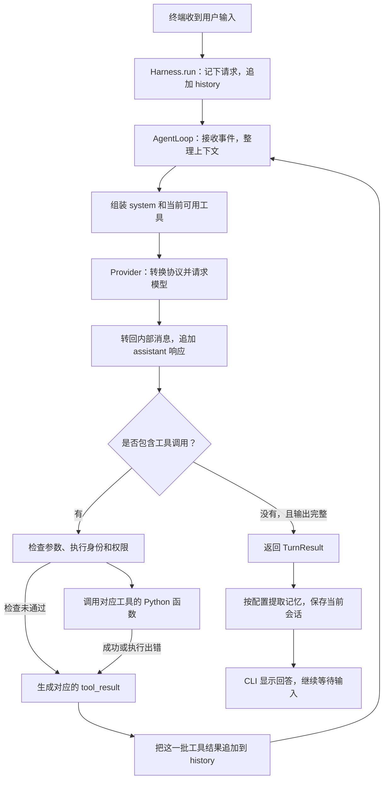

# 一次请求在 mini-agent-harness 中是怎么跑完的

做完这个项目后，我觉得最能说明代码关系的办法，就是拿一个请求从头走到尾。这里假设工作目录里有一个 `hello.txt`，内容是 `你好，世界！`，然后在 `mini-agent chat` 中输入：“读取 hello.txt，告诉我里面写了什么。”下面沿着这句话追踪代码和数据，先看主流程，再看后台任务、队友和 MCP 怎么接进来。消息示例都做了简化，用来说明内部结构，不是某次真实模型请求的日志。



图中是正常执行的主线。一次用户请求可能要经过多次模型调用，遇到错误、输出截断或步骤上限时，还有相应的恢复和退出处理。

## 启动时，先把运行所需的东西准备好

程序从 [`cli.py`](../src/mini_agent_harness/cli.py) 的 `main()` 进入。它先解析命令行参数，再调用 [`config.py`](../src/mini_agent_harness/config.py) 中的 `Settings.load()`，确定工作目录、模型、密钥、超时和上下文预算。默认读取工作目录下的 `.env`，也可以用 `--env-file` 指定。密钥留在本地配置和客户端中，不会被拼进系统提示词。

随后，`chat()` 创建 [`app.py`](../src/mini_agent_harness/app.py) 中的 `Harness`。`Harness._initialize()` 把模型客户端、工具注册表、权限检查、上下文管理、任务存储、队友管理、后台事件和 MCP 管理器接起来，同时创建空的 `history` 和主 Agent 的 `ExecutionContext`。进入 `with Harness(...)` 后，调度器也开始运行。这些服务在同一个宿主进程中复用，不会每收到一句话就重新创建。

工具也在这里注册。比如 `FileTools.register_tools()` 会把 `read_file` 的名称、说明、参数格式和 `FileTools.read` 函数放在同一个 `ToolSpec` 中，交给 `ToolRegistry` 保存。这样后面模型说要调用 `read_file`，程序就有明确的执行入口。此时只是登记能力，还没有读取文件；MCP 也只是加载本地连接配置，远程工具要连接服务器后才会加入注册表。

## 输入进入会话，再整理成模型需要的上下文

在终端按下回车后，`chat()` 先处理 `/new`、`/tasks`、`/quit` 这类本地命令。普通文字则通过 `asyncio.to_thread()` 交给 `Harness.run(query, interactive=True)`，让同步的模型循环在线程中执行，终端仍能协调审批输入。同一个 Lead 会话有锁保护，用户请求和后台事件触发的轮次会串行处理，避免同时修改同一份历史。

`Harness.run()` 记住当前请求，触发 `UserPromptSubmit` hook，然后把输入追加到 `self.history`。第一次输入后，它大致长这样：

```json
[
  {
    "role": "user",
    "content": "读取 hello.txt，告诉我里面写了什么。"
  }
]
```

接着，`Harness._turn()` 调用 [`core/agent.py`](../src/mini_agent_harness/core/agent.py) 的 `AgentLoop.run(history, ctx, active_request)`。这里有三份需要分清的数据：`history` 记录目前说过什么、调用过什么工具、拿到了什么结果；`ctx` 记录当前是谁在执行、角色是什么、在哪个目录操作、能否请求人工批准；`active_request` 单独保留当前要做的事，供上下文压缩时保留任务目标。`ctx` 的定义在 [`core/types.py`](../src/mini_agent_harness/core/types.py)，它由宿主管理，不由模型通过工具参数随意指定。

每次准备请求模型前，循环先检查停止信号，再调用 `teams.before_step(ctx)` 更新任务身份、处理队友控制消息，然后从 `EventBus` 取出属于当前 Agent 的通知。后台命令的结果、队友消息和 cron 提醒就在这个位置进入历史，带有 `origin: "runtime"` 标记，以及事件种类、正文和相关 ID。普通读文件请求没有这些事件，就直接往下走。

接下来是 [`context/manager.py`](../src/mini_agent_harness/context/manager.py) 中的 `ContextManager.prepare()`。它检查工具调用和结果是否配对，并按需要归档过长的工具输出、裁剪中段历史、缩短旧结果；仍然超出预算时，再生成摘要。处理后的消息会通过 `messages[:] = ...` 写回原来的 `history` 列表，所以会话实际保留的历史也会随之变化。被移出的内容有对应归档可查，当前请求则被单独带入压缩过程。这里按字符数估算预算，不是精确计算模型 token。

## 模型拿到什么，又会返回什么

整理完历史后，`Harness._system_prompt()` 调用 [`prompt.py`](../src/mini_agent_harness/prompt.py) 的 `assemble_prompt()`，把 Agent 身份、工作目录、任务信息、基本规则、技能目录和相关记忆组成 `system`。技能先提供目录和简短介绍，需要全文时再调用 `load_skill`；开启记忆后，系统会在每个模型步骤前尝试召回相关内容。这些内容作为参考资料加入提示词，不会变成新的用户授权。

与此同时，`registry.schemas(ctx)` 取出当前角色可用的工具说明。真正传入 `provider.generate()` 的核心数据就是 `messages`、`system` 和 `tools`，另有输出长度预算 `max_tokens`。工具的 Python 函数留在本地，模型收到的是名称、用途和参数格式。它根据这些描述决定下一步调用什么，由 Harness 负责执行。

[`models/providers.py`](../src/mini_agent_harness/models/providers.py) 负责把这套内部数据转换成具体模型接口的格式。Anthropic 使用它的消息和内容块；OpenAI Responses 使用 `instructions`、输入项、`function_call` 和 `function_call_output`；Chat Completions 则使用 `tool_calls` 和 `role: "tool"` 消息。Responses 模式每次提交的是当前本地历史转换后的输入，不依赖服务端替项目保存会话。模型响应回来后，适配器再将其整理成统一的 `ModelResponse`，主循环主要看 `text`、`tool_use` 和停止原因；需要后续回传的厂商原生推理内容也会保留相应来源信息。

在这个例子里，假设模型决定先读文件，返回的内部内容中就会包含：

```json
{
  "type": "tool_use",
  "id": "call_001",
  "name": "read_file",
  "input": {"path": "hello.txt"}
}
```

这时文件还没有被读取。`AgentLoop` 先把模型响应作为一条 `assistant` 消息加入历史，再从中找出工具调用。`call_001` 是这次调用的标识，后面的执行结果必须带着同一个 ID 回来，模型才能知道结果属于哪次操作。

模型网络请求的重试在 [`models/retry.py`](../src/mini_agent_harness/models/retry.py) 中处理。临时网络错误、限流等情况会按配置退避重试，配置了备用模型时也可能切换；鉴权和协议等错误不会无限重试。这个机制只包住模型调用，不会因为请求模型失败，就把之前已经执行的写文件等操作再做一次。

## 工具在本地执行，结果沿原路回到模型

拿到调用后，`AgentLoop` 先用 [`core/tools.py`](../src/mini_agent_harness/core/tools.py) 的 `ToolRegistry.validate()` 检查名称是否存在、角色能否使用、参数是否符合 JSON Schema。再由 `teams.before_tool()` 检查任务绑定和计划状态，随后触发 `PreToolUse` hook，执行 [`tools/permissions.py`](../src/mini_agent_harness/tools/permissions.py) 中的权限策略。需要批准的操作会交给 CLI 的审批回调；非交互轮次无法弹出审批，会返回拒绝结果。普通的 `hello.txt` 读取可以直接通过，读取 `.env` 等敏感文件则另有审批检查。

检查通过后才执行 `spec.handler(ctx, args)`。对于 `read_file`，这就是 [`tools/filesystem.py`](../src/mini_agent_harness/tools/filesystem.py) 的 `FileTools.read()`。它先用 `safe_path()` 按 `ctx.cwd` 解析路径、检查范围，再打开文件，按行读取并加上行号。因此同样一个 `hello.txt`，主 Agent 和绑定了 worktree 的队友可能会读到不同工作副本里的文件，具体位置由执行身份决定。读取有分页和长度限制，大文件可以继续翻页。

函数返回文本后，循环触发 `PostToolUse`，并把结果包装成 `tool_result`。如果参数检查、审批或执行过程中出错，也会为这次调用生成带 `is_error: true` 的结果，让模型有机会改正参数或调整做法。成功读取示例文件时，追加到历史的消息大致是：

```json
{
  "role": "user",
  "content": [
    {
      "type": "tool_result",
      "tool_use_id": "call_001",
      "content": "    1 | 你好，世界！\n",
      "is_error": false
    }
  ]
}
```

这里的 `role: "user"` 是内部协议存放工具结果的方式，不代表用户又输入了一句话。发给不同模型时，适配器会转换成相应的工具结果格式。一次响应里如果有多个工具调用，程序会按顺序执行，再把整批结果一起回填，保证“先写再读”这样的操作有确定顺序。`teams.after_step()` 在整批结束后处理任务租约；模型请求的 `compact` 也等结果配齐后再进行，避免压缩把调用和结果拆开。

至此，历史中已有“用户请求 → 模型要求读文件 → 文件读取结果”。循环会再次从事件处理和上下文准备开始，把这些信息送给模型。模型这次能看到真实文件内容，可以回答“hello.txt 中写的是‘你好，世界！’”；也可以继续请求别的工具。代码没有预先规定每个问题需要几次调用，而是一直执行到模型给出完整且不含工具调用的响应，或者触发停止条件。

## 回答怎样回到终端，哪些数据会留下

当模型给出完整响应且没有工具调用时，`AgentLoop` 返回 `TurnResult`，其中包含回答文本 `text`、当前消息 `messages`、步骤数 `steps` 和状态 `status`。正常结束时是 `completed`；步骤耗尽、持续截断或收到停止信号时，则分别返回 `step_limit`、`length_limit` 或 `stopped`。这里的“完成”表示循环正常结束，具体工作是否做对仍要结合工具结果和验证判断。

输出被截断时，循环会先提高输出预算，重试同一输入；后续续写也有次数限制，截断的工具调用不会执行。模型报告上下文溢出时，会尝试一次额外压缩后重试。无法恢复的模型异常则继续抛给宿主，由 CLI 显示错误类型。循环离开时会触发 `Stop` hook。

回到 `Harness._turn()` 后，若状态为 `completed` 且开启了记忆，才会调用 [`context/memory.py`](../src/mini_agent_harness/context/memory.py) 的 `MemoryStore.extract()`，从对话中筛选适合长期保存的信息；有新增记录时，再视条件合并。记忆召回、提取、合并以及上下文摘要都可能额外请求模型，所以一次用户输入的 API 请求次数不一定等于 `TurnResult.steps`，再加上网络重试就更不能直接画等号。

随后，`_turn()` 的 `finally` 路径调用 `_save_transcript()`，把当前历史写到工作目录下的 `.harness/sessions/<session_id>.json`，完成保存后 CLI 才打印 `result.text`。这份 JSON 是当前会话的快照，可能已经经过压缩；较早的完整内容要结合 `.harness/context/` 中的归档查看。任务、记忆、cron 和邮箱也有各自的本地存储，而工具注册表、运行线程和事件队列主要留在进程内存中。

在 `chat` 中继续输入时，沿用同一个 `Harness` 和当前 `history`，因此模型能接着上一轮工作；`/new` 会清空当前历史并换一个会话 ID，长期记忆仍然保留。重新启动程序目前不会自动恢复之前的会话 JSON。退出时，`Harness.close()` 按顺序停止调度器、Shell、后台任务和队友，再关闭 MCP 连接和模型客户端。一次性 `mini-agent run` 返回结果后就会关闭宿主，持续等待事件应使用 `chat`。

## 后台任务、队友和 MCP 从哪里接入

后台命令沿用同一套工具调用流程。模型调用 `bash` 并设置 `run_in_background: true`，通过审批后，`Harness._bash()` 会记住当时的工作目录，把执行交给 [`runtime/background.py`](../src/mini_agent_harness/runtime/background.py) 的 `BackgroundManager`，先返回任务 ID。命令完成后，结果通过 [`runtime/events.py`](../src/mini_agent_harness/runtime/events.py) 的 `EventBus` 发布。Agent 还在执行时，会在下一个模型步骤前取到它；Agent 正在等用户输入时，CLI 会被事件唤醒，调用 `Harness.poll()` 开启一个非交互轮次，再通过同一个循环处理结果。后台线程只发布事件，历史由接收它的 Agent 追加。

cron 也是这条通知路径。模型通过工具把调度写入 [`runtime/scheduler.py`](../src/mini_agent_harness/runtime/scheduler.py) 管理的本地记录，调度器到时间后发布事件。事件进入模型历史后，只有收到成功的模型响应，才会确认这次交付；未确认的通知允许重投。这个确认表示模型已接收提醒，不表示提醒要求的工作已经完成。调度记录可以持久化，但触发检查依赖宿主进程运行。

任务分工分成两种。调用 `task` 会在 `Harness._subagent()` 中创建新的执行身份、会话 ID 和空历史，再用同一个 `AgentLoop` 跑子任务，主 Agent 同步等待，最后收到子 Agent 的最终文本作为工具结果。调用 `spawn_teammate` 则交给 [`teams/manager.py`](../src/mini_agent_harness/teams/manager.py) 的 `TeamsManager`，让队友在独立线程中工作，并在多次任务之间保留自己的历史。队友通过任务存储认领工作，绑定对应目录，通过邮箱和事件交换消息；需要计划审批时，会在规定位置等待。两者都复用现有循环，差别主要在历史、身份、目录和生命周期。

MCP 改变的是工具的实际执行位置。模型先调用 `connect_mcp`，通过前台审批后，[`mcp/client.py`](../src/mini_agent_harness/mcp/client.py) 的 `MCPManager` 才连接本地配置中的服务器，发现工具并以 `mcp__服务器名__工具名` 注册。下一次模型调用重新读取工具列表时，就能看到这些新能力。之后模型选中某个 MCP 工具，仍然经过本地校验和权限检查，只是 handler 会把参数通过 stdio 或 Streamable HTTP 发给 MCP 服务器，收到的结果再变回 `tool_result`，接入前面读文件时走过的那条回路。

如果需要对照目录继续读代码，可以接着看 [架构说明](architecture.md)；各项配置和 MCP 接入方式放在 [配置文档](configuration.md)，从 s15 拆出每个模块的对应关系则在 [功能映射](s15-mapping.md) 中。
